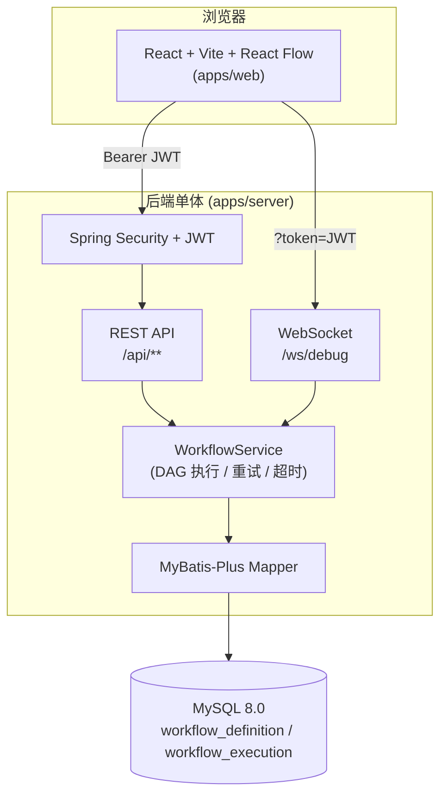
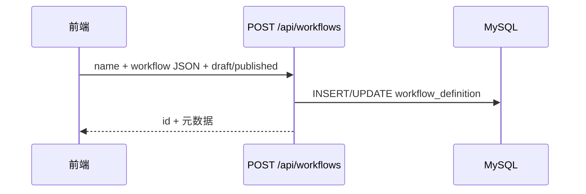
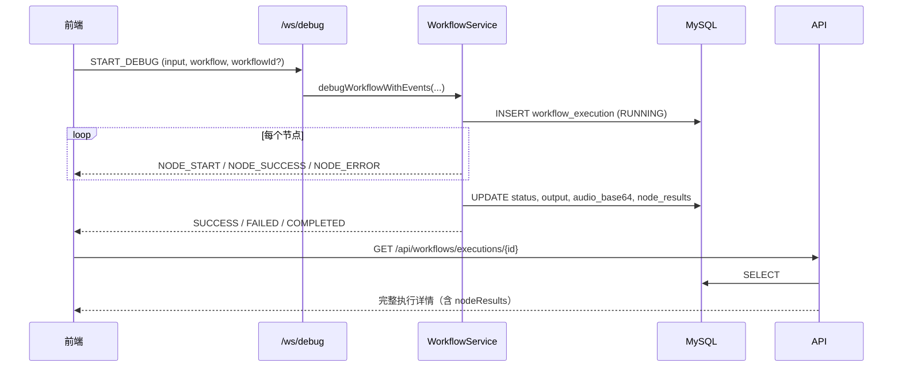

# Walnut Agent — 系统架构说明

本文档描述 **walnut-agent** 当前整体架构：模块划分、运行时组件、数据流、存储与对外接口。部署形态为 **本地单体**（前端静态资源由 Vite 开发服务器提供，后端为单一 Spring Boot 进程）。

---

## 1. 逻辑架构总览



**要点：**

- **前端**负责画布编排、节点配置 UI、调试面板；通过 **REST** 完成登录、工作流 CRUD、执行结果查询；通过 **WebSocket** 推送实时调试事件（与 REST 调试接口共享同一套执行引擎）。
- **后端**统一承载鉴权、工作流持久化、同步执行与执行记录落库。
- **MySQL** 仅存两类核心实体：工作流定义、执行记录（含节点级摘要 JSON）。

---

## 2. 仓库与模块划分（Monorepo）

| 路径 | 职责 |
|------|------|
| `apps/web` | 前端：React + TypeScript + Vite + React Flow，流图编辑与调试 UI |
| `apps/server` | 后端：Spring Boot 3、JWT、MyBatis-Plus、WebSocket、工作流执行 |
| `packages/workflow-engine` | 历史/预留的 **npm** 工作流包；**当前主执行逻辑在 Java `WorkflowService`**，该包可作为后续共享类型或独立引擎的占位 |

根目录 `package.json` 通过 `workspaces` 管理 `apps/web` 与 `packages/*`，`npm run dev` 会并行启动 Maven 后端与 Vite 前端（若本机 `spring-boot:run` 出现主类问题，可直接使用已打包的 `apps/server/target/server-*.jar` 启动后端）。

---

## 3. 后端分层结构（Spring Boot）

```
com.walnut.agent
├── AgentServerApplication.java      # 启动入口
├── config/                          # Security、数据源初始化等
├── controller/                      # REST：Auth、Workflow
├── dto/                             # 请求/响应 DTO（含 Debug、Execution）
├── entity/                          # 表实体（MyBatis-Plus）
├── mapper/                          # Mapper 接口
├── security/                        # JwtAuthFilter
├── service/                         # JwtService、WorkflowService（核心）
└── websocket/                       # WebSocket 配置与调试 Handler
```

**职责简述：**

- **Controller**：对外 REST；工作流相关路径统一前缀 `/api/workflows`。
- **Security**：除登录与 WebSocket 握手策略外，业务 API 默认需 **Bearer JWT**。
- **WorkflowService**：
  - 将前端传入的 `nodes` / `edges` 转为内部图结构；
  - **拓扑排序（Kahn）** 保证无环并按依赖顺序执行；
  - 节点类型分发：`input` / `llm` / `tool_tts` / `output`；
  - **节点级超时**、**失败重试（含退避）**、可中断语义；
  - 将整次执行与 **节点级结果摘要** 写入 `workflow_execution`。
- **WebSocket**：`/ws/debug` 接收 `START_DEBUG`，将执行过程事件流式推送给前端（与 REST `/debug` 共用执行逻辑）。

---

## 4. 前端结构（简要）

- **画布**：React Flow，自定义节点组件，支持拖拽、连线、箭头样式。
- **状态**：节点列表、边、选中节点、输出节点参数与模板等本地状态；部分“当前工作流”选择可持久化到 `localStorage` 以便刷新后恢复。
- **调用链**：
  1. `POST /api/auth/login` 获取 JWT；
  2. `GET /api/workflows/default` 或 `GET /api/workflows/{id}` 加载图；
  3. 调试：`WebSocket` 推送事件 + 完成后 `GET /api/workflows/executions/{id}` 或 `.../latest-execution` 拉取持久化结果。

---

## 5. 核心数据流

### 5.1 工作流保存（入库）



工作流以 **JSON** 形式存入 `workflow_definition.workflow_json`，包含节点与边的拓扑。

### 5.2 调试执行（WebSocket + 落库）



同步 REST 路径 `POST /api/workflows/debug` 同样走 `WorkflowService`，但不推送 WebSocket 事件，适合脚本或简单联调。

---

## 6. 数据模型（MySQL）

### 6.1 `workflow_definition`

| 字段 | 说明 |
|------|------|
| `workflow_json` | 工作流图 JSON（nodes/edges 等） |
| `is_draft` / `is_published` | 草稿 / 发布标记 |

### 6.2 `workflow_execution`

| 字段 | 说明 |
|------|------|
| `workflow_id` | 关联工作流（调试时可为 0 或未关联场景按实现约定） |
| `input_text` | 调试输入 |
| `status` | 本次执行总状态 |
| `output_text` / `audio_base64` | 最终文本与音频（Base64） |
| `node_results` | **节点级执行摘要**（JSON 文本，LONGTEXT），用于前端展示「节点执行状态」与历史回放 |
| `error_message` | 失败信息 |

表结构由 `apps/server/src/main/resources/schema.sql` 在启动时初始化；对已有库会通过可重复执行的脚本补列（如 `node_results`）。

---

## 7. 主要 REST API 一览

**认证**

| 方法 | 路径 | 说明 |
|------|------|------|
| POST | `/api/auth/login` | 登录，返回 JWT |

**工作流**

| 方法 | 路径 | 说明 |
|------|------|------|
| GET | `/api/workflows/default` | 默认/已发布工作流（含图中扩展字段如 workflowId） |
| GET | `/api/workflows` | 工作流列表 |
| GET | `/api/workflows/{workflowId}` | 按 ID 加载定义 |
| DELETE | `/api/workflows/{workflowId}` | 删除定义 |
| POST | `/api/workflows` | 保存工作流 |
| POST | `/api/workflows/debug` | 同步调试执行 |
| GET | `/api/workflows/executions/{executionId}` | 按执行 ID 查询结果（含 `nodeResults`） |
| GET | `/api/workflows/{workflowId}/latest-execution` | 该工作流最近一次执行 |

**WebSocket**

| 路径 | 说明 |
|------|------|
| `/ws/debug?token=<JWT>` | 实时调试事件流 |

---

## 8. 执行策略（引擎行为）

| 项目 | 当前约定 |
|------|----------|
| 执行模式 | 同步（请求线程内执行） |
| 节点超时 | 可配置，默认约 10s（见 `application.yml`） |
| 失败重试 | 默认可配置次数与退避 |
| 拓扑 | DAG，循环图会拒绝执行 |
| 音频 | 以 Base64 形式在响应/库中返回 |

---

## 9. 配置与端口

| 配置项 | 典型值 |
|--------|--------|
| 后端 HTTP | `8787`（`application.yml`） |
| 前端开发服务器 | `5173`（Vite 默认） |
| 数据库 | `application.yml` 中 `spring.datasource.*` |
| JWT | `security.jwt.*` |
| SQL 初始化 | `spring.sql.init.mode` + `schema.sql` |

---

## 10. 演进方向（非当前必现）

- **执行异步化**（队列、任务表、轮询/推送）
- **多租户 / 权限模型** 细化
- **LLM/TTS 厂商适配层**（统一 ChatClient、多模型路由）
- **可观测性**（结构化日志、指标、Trace）
- **workflow-engine 包** 与 Java 引擎的职责再划分或 WASM/独立进程等

---

## 11. 相关文档

- [README.md](./README.md) — 快速启动与默认账号
- [SUMMARY.md](./SUMMARY.md) — 项目背景与更偏「产品/过程」的总结
